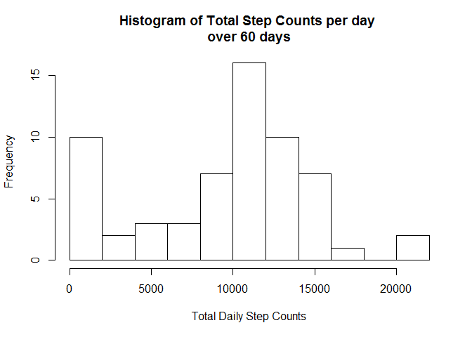
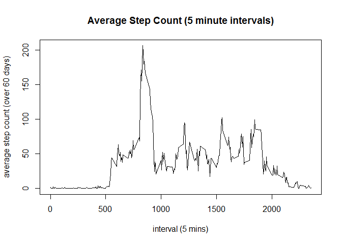
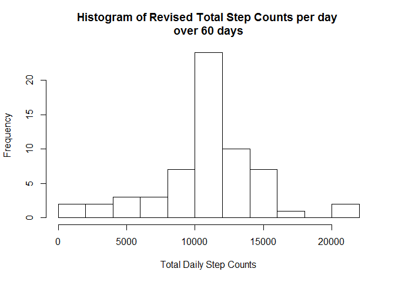
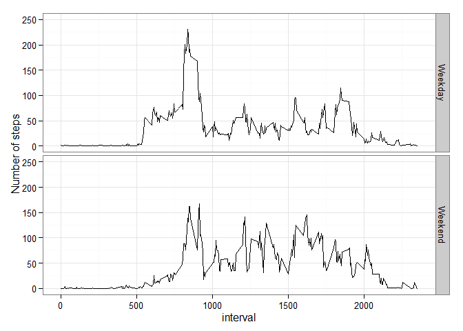

# Reproducible Research: Peer Assessment 1

This is the markdown file to the Peer Assessment 1 assignment. 
Note that the relevant zip file is in the same Git Hub repository; the data can be downloaded [here](https://d396qusza40orc.cloudfront.net/repdata%2Fdata%2Factivity.zip/).

## Loading and preprocessing the data
this step loads the data in R, and formats the date variable as an R date variable.


```r
stepdata <- read.csv(unz("./activity.zip", "activity.csv"))
stepdata$date <- as.Date(stepdata$date, "%Y-%m-%d") # format date vars to R date vars
head(stepdata) #show first few rows of data
```

```
##   steps       date interval
## 1    NA 2012-10-01        0
## 2    NA 2012-10-01        5
## 3    NA 2012-10-01       10
## 4    NA 2012-10-01       15
## 5    NA 2012-10-01       20
## 6    NA 2012-10-01       25
```

## Calculate mean, median and total daily steps
this step calculates the totals, mean and median steps taken a day (between 01-10-12 - 30-11-12).


```r
library(reshape2); library(ggplot2) # load relevant libraries
# melt the data so that it can be aggregated at a daily level
stepsummary <- melt(stepdata[, 1:2], id = "date")
stepsumm <- dcast(stepsummary, date ~ variable, fun.aggregate = sum, na.rm = TRUE)
datecount <- as.numeric(max(stepdata$date)-min(stepdata$date))
hist(stepsumm$steps, xlab = "Total Daily Step Counts", main = paste("Histogram of Total Step Counts per day \nover", datecount, "days"), breaks=15) #plot histogram
```

 

Having observed the distribution (via histogram plot) of the daily step counts, we will now calculate the mean and median of the total daily step counts.


```r
stepmean <- format(mean(stepsumm$steps), nsmall=2) # calculate the mean daily step counts (over 60 days)
stepmed <- format(median(stepsumm$steps), nsmall=2) # calculate the median daily step counts (over 60 days)
```

the mean daily step count is 9354.23 steps, while the median step count is 10395 steps (over 60 days). The mean is approximately 1000 steps lower than the median, indicating some skew (which could have been impacted by the missing values).

## Average Daily Activity Pattern
We will now explore if there are any trends in the daily activity patterns.This is accomplished by averaging out the daily step counts for at an interval level (e.g. interval 0's step count is averaged across all days at that interval level).


```r
# recast the data, so that steps are averaged across all days for a given interval
stepint <- melt(stepdata[, c(1, 3)], id = "interval")
stepintsumm <- dcast(stepint, interval ~ variable, fun.aggregate = mean, na.rm = TRUE)
with(stepintsumm, plot(interval, steps, type="l", main="Average Step Count (5 minute intervals)", xlab="interval (5 mins)", ylab=paste("average step count (over", datecount, "days)")))
```

 

```r
max_ave <- round(max(stepintsumm$steps), 2)
max_int <- with(stepintsumm, stepintsumm[round(steps, 2)==max_ave, "interval"])
```

It appears that most of the steps are completed in the first half of the day.
The 5 minute interval containing the maximum average number of steps occurs at interval 835, with 206.17 steps.

## Imputing missing values
This step calculates the amount of missing data, to ensure this does not introduce bias in some of the calculations or summaries.


```r
sum.na <- sum(is.na(stepdata$steps))
rowcnt <- nrow(stepdata)
na.pct <- paste(round(sum.na/rowcnt*10,2), "%", sep="")
```
The total number of missing step counts are 2304 entries, out of 17568 entries (1.31%). 

The missing entries do not appear to be too material, so it shouldn't introduce too much bias in calculations and summaries. For completeness, we will use the daily 5 minute mean step entries to fill in the missing step entries, to reduce any bias present.


```r
colnames(stepintsumm)[2] <- "meansteps"
# fill in the missing entries
newstepdata <- merge(stepdata, stepintsumm)
newstepdata$imputed_steps = ifelse(is.na(newstepdata$steps), newstepdata$meansteps,newstepdata$steps)
```

We will now check if the statistics for the new data set is significantly different to the original dataset.


```r
newstepsummary <- melt(newstepdata[, c(3, 5)], id="date")
newstepsumm <- dcast(newstepsummary, date ~ variable, fun.aggregate=sum)
hist(newstepsumm$imputed_steps, xlab = "Total Daily Step Counts", main = paste("Histogram of Revised Total Step Counts per day \nover", datecount, "days"), breaks=15) #plot histogram
```

 

Given the previous histogram of daily step counts had not included the imputed steps (both for daily and specific intervals), we should expect to see the histogram plots to shift from the lower step counts to the centre.

We will now calculate the revised mean and median of the total step counts.


```r
newstepmean <- format(mean(newstepsumm$imputed_steps), nsmall=2) # calculate the mean daily step counts (over 60 days)
newstepmed <- format(median(newstepsumm$imputed_steps), nsmall=2) # calculate the median daily step counts (over 60 days)
```


```r
# do some calcs here for stats diff
meandiff <- as.numeric(newstepmean) - as.numeric(stepmean)
meddiff <- as.numeric(newstepmed) - as.numeric(stepmed)
```

The revised mean daily step count is now 10766.19 steps (difference of 1411.96 steps), and the revised median daily step count is now 10766.19 steps (difference of 371.19 steps). Filling in the missing step counts with the median step counts (5 minute intervals) has:

* changed the totals (evident in histogram plot), median and mean values
* increased the totals, median and the mean, as this has added in the missing step counts with the mean step counts
* made the mean equal to the median - this makes sense as we have replaced the missing values with the mean step counts (hence reducing the bias)

## Differences in Activity Patterns between Weekdays and Weekends

We will now check if there are differences in activity patterns between weekdays and weekends.


```r
newstepdata$daytype <- ifelse(weekdays(newstepdata$date) %in% c("Saturday", "Sunday"), "Weekend", "Weekday") #create new variable indicating day type
daystepsummary <- melt(newstepdata[, c(1,5, 6)], id=c("interval", "daytype"))
daystepsumm <- dcast(daystepsummary, interval + daytype ~ variable, fun.aggregate=mean)
p <- qplot(interval, imputed_steps, data=daystepsumm, facets = daytype ~ ., type="l", geom="line", ylab="Number of steps", ylim=c(0, 250))
p + theme_bw()
```

 

From the plots - there is a clear distinction in step count pattern, between weekdays and weekends. Some of the observations include:

* Weekday step counts tend to have higher step counts before 10am compared to weekends
* Weekends tend to have a slightly higher step count average after 10am, and tends to be much more spread out

These differences could be due to: 

* Higher pre-10am step count for weekdays: individuals having to prepare for the day, when they are going to work / school. This eventually drops as they could be in an office or school environment (requiring them to sit)
* more evenly distributed step counts for weekends: individuals not being bound by obligations to go to school / work, and doing more recreational activities
